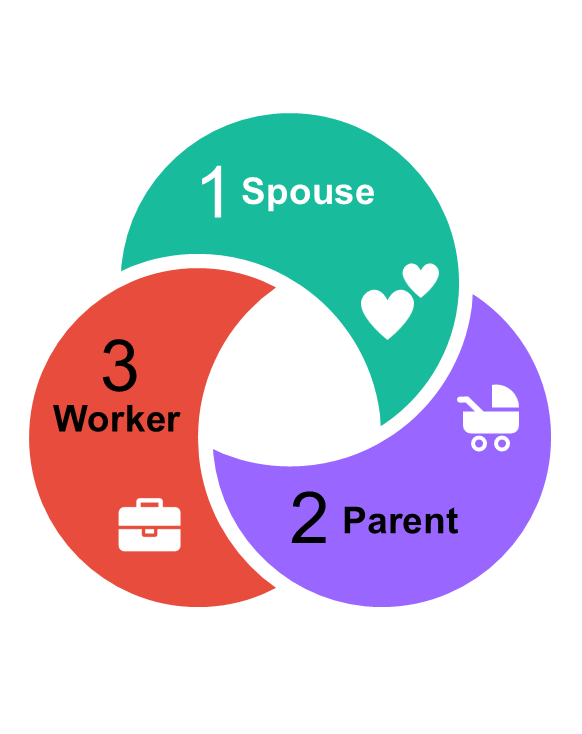

```{r warning = FALSE, error = FALSE, message = FALSE, echo=FALSE, results='hide'}
# Loading libraries
library(tidyverse)
library(gtsummary)
library(gghighlight)
library(readxl)
library(scales)
library(jsonlite)
library(ggrepel) 
library(patchwork)
library(MASS)
library(srvyr)
library(modelsummary)
library(ggeffects)
library(flextable)
library(ftExtra)

# Define color palette
c_palette <- c("#18BC9C",
               "#3498DB",
               "#F39C12",
               "#9966FF",
               "#E74C3C")

# Our world in data
df.mar <- read.csv("https://ourworldindata.org/grapher/marriage-rate-per-1000-inhabitants.csv?v=1&csvType=filtered&useColumnShortNames=true&time=1970..latest&country=CAN~USA~GBR~KOR~ISL") |>
  rename(marriage_rate = value__gender_both__indicator_marriage_rate)

df.birth <- read.csv("https://ourworldindata.org/grapher/children-born-per-woman.csv?v=1&csvType=filtered&useColumnShortNames=true&time=1970..latest&country=CAN~USA~GBR~KOR~ISL")

df.lfp <- read.csv("https://ourworldindata.org/grapher/female-employment-to-population-ratio.csv?v=1&csvType=filtered&useColumnShortNames=true&tab=line&time=1970..latest&country=CAN~USA~GBR~KOR~ISL")

# Open processed cross-sectional data
load(file.path("data/df.Rda"))

## Create survey data 
mtf_svy <- data |>
  select(c(gdsp, gdpa, gdwk, gdsp_v, gdpa_v, gdwk_v, gdsp_num, gdpa_num, gdwk_v, 
           svyweight, year, year.c, decade,
           sex, momed, race, region,
           getmar, mar3, mardum, markids, kids3, kidsdum)) |>
  # weight data
  as_survey_design(
    ids = NULL,
    weights = svyweight)

data$mar3  <- relevel(data$mar3,  ref = 1)
data$kids3 <- relevel(data$kids3, ref = 3)

# VDE Data

## RQ2
df_mlmc <- read_xlsx(
  file.path("data/FS_mlmc.xlsx"),
  sheet = "mods04_predict",
  skip  = 1)

## RQ3
df_logit <- read_xlsx(
  file.path("data/FS_logit.xlsx"),
  sheet = "mods06_predict",
  skip = 1)

```


## {data-menu-title="Demographic Context"}

```{r warning = FALSE, fig.width=14, fig.asp=.58}

data_ends.mar <- df.mar |>
  group_by(entity) |>
  top_n(1, year) 

p1 <- df.mar |>
  ggplot(aes(x = year, y = marriage_rate, color = entity)) +
  geom_line(linewidth = 2) +
  geom_text_repel(aes(label = code), data = data_ends.mar, size = 6, nudge_x = 4) +
  theme_minimal(20) +
  theme(
    legend.position     = "none",
    legend.title        = element_blank(),
    panel.grid.minor    = element_blank(),
    panel.grid.major.x  = element_blank(),
    plot.margin         = unit(c(0, 0, 0, 0), "null"),
    panel.margin        = unit(c(0, 0, 0, 0), "null"),
    plot.subtitle       = element_text(color = "grey50", size = 16),
    plot.title.position = "plot") +
  scale_y_continuous(
    breaks = seq(0, 12, by=2), 
    limits = c(0, 12)) +
  scale_color_manual(values = c("#e74c3c", "#18BC9C","#9966FF", "#F39C12", "#3498DB")) +
  labs( x        = " ", 
        y        = " ",
        title    = "Marriage rates",
        subtitle = "Yearly marriage per 1,000 people")


data_ends.birth <- df.birth |> 
  group_by(entity) |> 
  top_n(1, year) 

p2 <- df.birth |> 
  ggplot(aes(x = year, y = fertility_rate_hist, color = entity)) +
  geom_line(linewidth = 2) +
  geom_text_repel(aes(label = code), data = data_ends.birth, size = 6, nudge_x = 4) +
  theme_minimal(20) +
  theme(
    legend.position     = "none",
    legend.title        = element_blank(),
    panel.grid.minor    = element_blank(),
    panel.grid.major.x  = element_blank(),
    plot.margin = unit(c(0, 0, 0, 0), "null"),
    panel.margin = unit(c(0, 0, 0, 0), "null"),
    plot.subtitle       = element_text(color = "grey50", size = 16),
    plot.title.position = "plot") +
  scale_y_continuous(
    breaks = seq(0, 4, by=1), 
    limits = c(0, 4)) +
  scale_color_manual(values = c("#e74c3c", "#18BC9C","#9966FF","#F39C12", "#3498DB")) +
  labs( x        = " ", 
        y        = " ",
        title    = "Total fertility rate",
        subtitle = "Number of births per woman")


data_ends.lfp <- df.lfp |> 
  group_by(entity) |> 
  top_n(1, year) 

p3 <- df.lfp |>
  ggplot(aes(x = year, y = sl_emp_totl_sp_fe_ne_zs, color = entity)) +
  geom_line(linewidth = 1.5) +
  geom_text_repel(aes(label = code), data = data_ends.lfp, size = 6, nudge_x = 4) +
  theme_minimal(20) +
  theme(
    legend.position     = "none",
    legend.title        = element_blank(),
    panel.grid.minor    = element_blank(),
    panel.grid.major.x  = element_blank(),
    plot.margin         = unit(c(0, 0, 0, 0), "null"),
    panel.margin        = unit(c(0, 0, 0, 0), "null"),
    plot.subtitle       = element_text(color = "grey50", size = 16),
    plot.title.position = "plot") +
  scale_y_continuous(
    breaks = seq(0, 100, by=25), 
    limits = c(0, 100)) +
  scale_color_manual(values = c("#e74c3c", "#18BC9C","#9966FF", "#F39C12", "#3498DB")) +
  labs( x        = " ", 
        y        = " ",
        title    = "Women's employment",
        subtitle = "Proportion of women 15+ that is employed")


p1 + plot_spacer() + p2 + plot_spacer() + p3 + plot_layout(widths = c(3, .1 , 3, .1, 3))

```

:::: aside 
::: {style="font-size: 70%; color: #adb5bd;"}
ourworldindata.org/grapher/marriage-rate-per-1000-inhabitants  
ourworldindata.org/grapher/children-born-per-woman  
ourworldindata.org/grapher/female-employment-to-population-ratio  
:::
::::

:::: {.content-visible when-profile="speaker"}
::: notes
Demographers interested in tracking what young adults ACTUALLY DO through young adulthood\
- Demographic research documented declining rates in marriage/fertility.\

**Second Demographic Transition** - suggests a shift in values from traditional to individualistic norms precedes these behaviors.\
- research focuses on cultural shifts\
- changes in ideals/aspirations

**Structural changes**\
- economic forces account for some behavior.\
- expectations for self
:::
::::

## Caregiving Ambitions Framework {data-menu-title="Caregiving Roles"}

:::: columns

::: column

<br>

::: {style="font-size: 150%; font-family: 'Shadows Into Light'"}
[**Motivation to give care**]{style="color: #F39C12"}, across a variety of contexts 
and over the lifespan, [**is central to understanding life goals**]{style="color: #F39C12"} 
and ultimately behavior.  
:::

::: {style="font-size: 60%; color: #6c757d; margin-top: 0.5em;"}  
Bear 2019
:::

:::

::: column

:::

::::

:::: {.content-visible when-profile="speaker"}
::: notes
Youth and their anticipated roles\
Career but also caring roles of being a partner to someone, of having children as central
-   proposes that motivation to give care, across a variety of contexts and over the lifespan, central to understanding life goals and ultimately behavior.  
-   often think of caring for child or someone with a disability.\
-   we argue should expand definition to include caring for one's spouse\
-   and in-direct caregiving through monetary support\
-   look at caregiving in 3 roles: spouse, parent, worker\
:::
::::


## Research Questions {data-menu-title="Research Questions" background-image="images/questionmark-gray.png" background-size="100px" background-repeat="repeat"}

<br>  

::: {.incremental .highlight-last style="font-size: 100%"}
1.  Have youths’ expectations of becoming a good spouse or parent (*direct caregiving*) and a good worker (*indirect caregiving*) changed across historical time?\
  
2.  Do expectations of being a good caregiver change through early adulthood (ages 18–30)?\
  
3.  Do early expectations (*RQ1*) or the trajectories (*RQ2*) about becoming a good spouse or parent predict transitions into these roles?
:::

:::: {.content-visible when-profile="speaker"}
::: notes
[**\<click\>**]{style="color: #E74C3C;"}\
First RQ: \[read it\]\

[**\<click\>**]{style="color: #E74C3C;"}\
Second RQ \[read it\]\

[**\<click\>**]{style="color: #E74C3C;"}\
Third RQ \[read it\]\

gender differences?
:::
::::

## Monitoring the Future Surveys {data-menu-title="Data"}

::::: columns

:::: {.column width="45%"}

<br>  
<br>  

Nationally representative sample of U.S. 12th-graders 
(1976-2024)  

---

N = 100,251

::::

:::: {.column width="55%"}

<br>  
<br>    

::: {style="color: #e74c3c; font-size: 110%; font-family: 'Shadows Into Light'"}

**How good do you think you would be as a**:  
  
-   husband or wife?  
-   parent?  
-   worker on a job?  
:::
  
::: {style="font-size: 70%"}
**poor | not so good | fairly good | good | very good**  
:::
::::

::::: 

::: aside
<https://www.icpsr.umich.edu/web/ICPSR/series/35>
:::

:::: {.content-visible when-profile="speaker"}
::: notes
study changes in the beliefs, attitudes, and behavior of young people in the United States.\
:::
::::


## Sample {data-menu-title="Sample"}

```{r results = 'asis', warning = FALSE}

mtf_svy |>
  tbl_svysummary(
    include = c("sex", "momed", "race", "region"),
    by = sex,
    type  = list(
      c(momed) ~ "dichotomous"),
    value = list(momed = "Completed college"),
    label = list(
      momed           ~ "Mom completed college",
      race            ~ "Race identity",
      region          ~ "Region"),
    statistic = list(
      all_continuous()  ~ "{median} ({p25}, {p75})",
      all_categorical() ~ "{p}%"))  |>
  add_overall() |>
  modify_header(
    label  = '**Variable**',
    all_stat_cols() ~ "**{level}**  
    N = {style_number(n_unweighted)} ({style_percent(p)}%)") |>
  modify_footnote(c(all_stat_cols()) ~ NA) |>
  as_gt() |>
  gt::tab_options(table.font.size = 28) |>
   gt::tab_source_note(
    source_note = "Source: Monitoring the Future (MTF) Surveys (1976-2024)"
  )
```

:::: {.content-visible when-profile="speaker"}
::: notes
descriptive statistics of the sample.\
Also include these variables in our full models.
:::
::::

:::: {.content-visible when-profile="speaker"}
::: notes
stepwise ordinal logistic regression models:

1.  bivariate\
2.  year \* year^2^ + all control variables\
3.  interacted year and gender.

show the predicted % rather than tables of coef.
:::
::::


##  {data-menu-title="Change over time"}

```{r warning = FALSE}

polr2.sp.RS  <- polr(gdsp ~ year.c * sex + I(year.c^2) * sex +
                       momed + race + region,
                     data = data, weights = svyweight, Hess = T)

polr2.pa.RS  <- polr(gdpa ~ year.c * sex + I(year.c^2) * sex  + 
                       momed + race + region,
                     data = data, weights = svyweight, Hess = T)

polr2.wk.RS  <- polr(gdwk ~ year.c * sex + I(year.c^2) * sex  + 
                       momed + race + region,
                     data = data, weights = svyweight, Hess = T)

## Average Predictions 
pp_sp_sex   <- predict_response(polr2.sp.RS, terms = c("year.c [all]", "sex"))
pp_pa_sex   <- predict_response(polr2.pa.RS, terms = c("year.c [all]", "sex"))
pp_wk_sex   <- predict_response(polr2.wk.RS, terms = c("year.c [all]", "sex"))

## Combine dfs
pp_sp_sex$cat    <- "Spouse" 
pp_pa_sex$cat    <- "Parent" 
pp_wk_sex$cat    <- "Worker" 

df_pp_sex <- rbind(pp_wk_sex, pp_sp_sex, pp_pa_sex)

## Tidy variables
df_pp_sex$response.level <- factor(df_pp_sex$response.level, 
                                   levels=c("Poor",
                                            "Not so good", 
                                            "Fairly good", 
                                            "Good",
                                            "Very good"))

df_pp_sex$cat <- factor(df_pp_sex$cat, 
                        levels=c("Spouse", 
                                 "Parent",
                                 "Worker"))

lables_year <- c("'76", "'92", "'08", "'24")

data_end <- df_pp_sex |>
  group_by(group, cat, response.level) |>
  slice_max(x, n = 1) |>
  filter(response.level == "Very good")

data_min <- df_pp_sex |>
  group_by(group, cat, response.level) |>
  slice_min(x, n = 1) |>
  filter(response.level == "Very good")

data_max <- df_pp_sex |>
  group_by(group, cat, response.level) |>
  slice_max(predicted, n = 1) |>
  filter(response.level == "Very good")

```


```{r warning = FALSE, fig.width=14, fig.asp=.58}

## Draw figure

df_pp_sex |>
  ggplot(aes(x = x, y = predicted, fill = response.level)) +
  geom_area(position = "stack") +
  geom_line(
    data = subset(df_pp_sex, response.level == "Very good"),
    aes(x = x, y = predicted, group = interaction(group, cat)),
    color = "#18BC9C",
    linewidth = 1) +
  geom_text_repel(data = data_end, 
                  aes(label = scales::percent(predicted, 1)), 
                  size = 6, nudge_y = .05, color = "grey40",
                  segment.color = 'transparent') +
  geom_text_repel(data = data_min, 
                  aes(label = scales::percent(predicted, 1)), 
                  size = 6, nudge_y = -.04, color = "grey40",
                  segment.color = 'transparent') +
  geom_text_repel(data = data_max, 
                  aes(label = scales::percent(predicted, 1)), 
                  size = 6, nudge_y = .03, color = "grey40",
                  segment.color = 'transparent') +
  geom_text_repel(data = data_min |> filter(cat == "Spouse"), 
                  aes(label = group), 
                  size = 7, nudge_x = 8, nudge_y = .15, 
                  segment.color = 'transparent', color = "grey20", fontface = "bold") +
  facet_grid(rows = vars(group), cols = vars(cat)) +
  theme_minimal(base_size = 24) +
  theme(
    legend.position   = "right",
    strip.text        = element_text(size = 20, face = "bold"),
    strip.text.y      = element_blank(),
    axis.title        = element_blank(),
    axis.text.y       = element_blank(),
    axis.ticks.y      = element_blank(),
    panel.grid.minor  = element_blank(),
    legend.title      = element_blank(),
    panel.spacing     = unit(2, "lines"),
    plot.subtitle     = element_text(size = 18, color = "grey60", face = "italic")) +
  scale_x_continuous(breaks=c(-20.80, -4.80, 11.20, 27.20), labels = lables_year) +
  scale_fill_manual(values = rev(c("#18BC9C50", "#3498DB20", "#9966FF30", "#F39C1260", "#e74c3c80"))) +
  labs( title = "The share of youth expecting to be 'very good' spouses, parents, & workers 
has fallen after decades of growth.")

```


:::: aside
::: {style="font-size: 70%; color: 'grey40';"}
Predicted probability of expectations of future adult roles, adjusted for mother’s education, race, and region;  
Data: *Monitoring the Future Surveys (U.S. 12th grade students)*
:::
::::

:::: {.content-visible when-profile="speaker"}
::: notes
-   good worker self higher than parent and spouse positive self entire 50 years
-   Controlling for vars, **including expectations**, an inverse U-shape with more positive futures in caring roles through 2000s then decline from 2010ish\
-   a strong gendered convergence in future selves by gender
-   young men envision being competent parents and partners at the same rate as young women now,\
-   young women very good at their job, from quite substantial gender traditional competencies in the 1970s
:::
::::

##  {data-menu-title="Change over early adulthood"}

```{r warning = FALSE, fig.width=14, fig.asp=.58}

df_mlmc$cat <- factor(df_mlmc$cat, 
                        levels=c("Spouse", 
                                 "Parent",
                                 "Worker"))

df_mlmc |>
  ggplot(aes(x = factor(cat), y = predicted, fill = factor(x))) +
  geom_col(position = position_dodge(width = .6),
           width = .5, alpha = .7) +
  geom_errorbar(aes(ymin = conf.low, ymax = conf.high),
                color = "grey50",
                position = position_dodge(width = .6),
                width = .05) +
  geom_text(aes(label = x, y = 0), 
            position = position_dodge(width = .6),
            vjust = 1.5, size = 5, color = "grey30") +
  facet_wrap(~group) +
  theme_minimal(base_size = 24) +
  scale_y_continuous(limits = c(-0.3,5), breaks = 0:5) +
  theme(
    legend.position    = "none",
    strip.text         = element_text(size = 20, face = "bold"),
    strip.text.y       = element_blank(),
    axis.title         = element_blank(),
    axis.ticks.y       = element_blank(),
    panel.grid.minor   = element_blank(),
    panel.grid.major.x = element_blank(),
    legend.title       = element_blank(),
    panel.spacing      = unit(2, "lines"),
    strip.placement    = "outside",
    strip.position     = "bottom",
    plot.subtitle      = element_text(size = 18, color = "grey60", face = "italic")) +
  scale_x_discrete(position = "top") +
  scale_fill_manual(values = c("#18BC9C", "#e74c3c50", "#9966FF"))  +
  labs( title = "Expectations about how good (on a 1–5 scale) one will be in caring roles 
remain largely stable from ages 18 to 30.")

```

:::: aside
::: {style="font-size: 70%; color: 'grey40';"}
Predicted expectations (1–5 scale: 'poor' to 'very good') from MLMC regressions for ages 18–30, adjusted for birth decade, race, mother’s education and employment, and family structure;  
Data: *Monitoring the Future Surveys (U.S. 12th grade students)*
:::
::::

:::: {.content-visible when-profile="speaker"}
::: notes

:::
::::

## {data-menu-title="Transitions to marriage and parenthood"}

```{r warning = FALSE, fig.width=14, fig.asp=.58}

df_logit$x <- factor(df_logit$x, levels = c("Poor", "Not so good", "Fairly good", "Good", "Very good"))

df_logit |> 
  ggplot(aes(x=cat, y = predicted, fill = x, alpha = highlight,
             ymin = conf.low, ymax = conf.high)) + 
  geom_col(
    position = position_dodge(width = .8), width = .7) +
  geom_text(
    aes(label = dplyr::if_else(highlight, x, ""), y = predicted * 0.1, 
        group = x),         
    position = position_dodge(width = .8),
    angle    = 90,
    hjust    = 0,
    vjust    = 0.5,
    size     = 4,
    color    = "white") +
  geom_errorbar(
    position = position_dodge(width = .8), width = .2, color = "grey80") +
  facet_wrap(~group) +
  theme_minimal(base_size = 24)  +
  guides(alpha = "none") +
  theme(
    legend.position    = "none",
    strip.text         = element_text(size = 20, face = "bold"),
    strip.text.y       = element_blank(),
    axis.title         = element_blank(),
    axis.ticks.y       = element_blank(),
    panel.grid.minor   = element_blank(),
    panel.grid.major.x = element_blank(),
    legend.title       = element_blank(),
    panel.spacing      = unit(2, "lines"),
    strip.placement    = "outside",
    strip.position     = "bottom",
    plot.subtitle      = element_text(size = 18, 
                                      color = "grey60", 
                                      face = "italic")) +
  scale_x_discrete(position = "top") +
  scale_fill_manual(values = rev(c("#18BC9C", "#3498DB", "#9966FF", "#F39C12", "#e74c3c")))  +
  scale_alpha_manual(values = c(`FALSE` = 0.2, `TRUE` = 0.9)) +
  labs( title = "Young women who expect to be “very good” in caring roles show the 
highest predicted likelihood of entering them by age 30.")

```

:::: aside
::: {style="font-size: 70%; color: 'grey40';"}
Predicted probability of marriage or parenthood by age 30, adjusted for birth decade, race, maternal education and employment, and family structure;  
Note: Highlighted bars denote statistically significant difference from 'very good', within role and gender;  
Data: *Monitoring the Future Surveys (U.S. 12th grade students)*
:::
::::

:::: {.content-visible when-profile="speaker"}
::: notes

:::
::::

## Summary

::: {.incremental .highlight-last style="font-size: 100%"}
-    **Historical shifts in caregiving expectations (RQ1)**  
A declining proportion of young people anticipate excelling in caring roles in the recent decade.  
  
-    **Developmental stability in early adulthood (RQ2)**  
Young adults’ views of their caring ability stay largely stable through early adulthood.  
  
-    **Predictive power of early expectations (RQ3)**  
High early caregiving expectations shape later life direct caring transitions...for women.  
:::

:::: {.content-visible when-profile="speaker"}
::: notes

:::
::::

## Final Thoughts

<br>  

Women born in the 1960s have 31% lower odds of marriage and 22% lower odds of parenthood than those born in the 1950s.  
  
<br>  

Women born in the 1990s have 89% lower odds of marriage and 85% lower odds of parenthood.    

<br>  

::: {style="color: #E74C3C; font-size: 110%; font-family: 'Shadows Into Light'"}
**Expectations about caring roles are important, but the decade women were born matters much more for their likelihood of becoming a spouse and parent.**  
:::

# Thank you!

::::: columns
::: {.column width="50%"}
<br>

Joanna R. Pepin\
*University of Toronto*

<br>

Melissa A. Milkie\
*University of Toronto*
:::

::: {.column width="50%"}
{fig-align="center" width="100%"}
:::
:::::

:::: {.content-visible when-profile="speaker"}
::: notes
Thanks!
:::
::::

