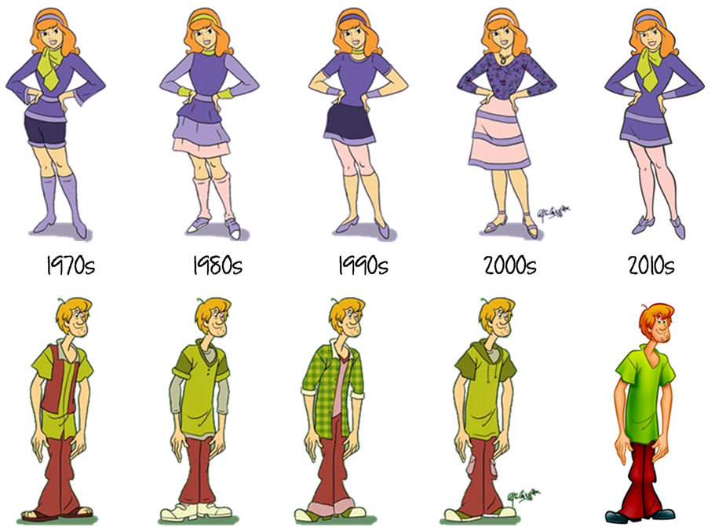

```{r warning = FALSE, error = FALSE, message = FALSE, echo=FALSE, results='hide'}
# Loading libraries
library(tidyverse)
library(gtsummary)
library(gghighlight)
library(scales)

# Define color palette
c_palette <- c("#18BC9C",
               "#3498DB",
               "#F39C12",
               "#9966FF",
               "#E74C3C")

# Run project scripts
source(file.path("scripts/FS_00-1_setup and packages.R"))
source(file.path("scripts/FS_01_measures and sample.R"))

```

# Background

##  {#famrates-id data-menu-title="Marriage and Parenthood Rates"}

```{r warning = FALSE, fig.width=14, fig.asp=.55}

library(tidyverse)
library(jsonlite)
library(ggrepel) 
library(patchwork)
library(statcanR) # get CAN data

df.mar <- read.csv("https://ourworldindata.org/grapher/marriage-rate-per-1000-inhabitants.csv?v=1&csvType=filtered&useColumnShortNames=true&time=1970..latest&country=CAN~USA~SWE~KOR~ITA")

CANdata <- statcan_data("39-10-0055-01", "eng") %>%
  filter(Indicator == "Crude marriage rate" & GEO == "Canada") %>%
  select(REF_DATE, VALUE) %>%
  mutate(Year = stringr::str_sub(string = REF_DATE, start = 1, end = 4)) %>%
  filter(Year >= 2009) %>%
  rename(marriage_rate = VALUE) %>%
  select(Year, marriage_rate)

CANdata$Entity <- 'Canada'
CANdata$Code   <- 'CAN'

df.mar <- rbind(df.mar, CANdata) %>% 
  arrange(Entity) %>%
  mutate(Year = as.integer(Year))

data_ends.mar <- df.mar %>%
  group_by(Entity) %>%
  top_n(1, Year) 

p1 <- df.mar %>%
  ggplot(aes(x = Year, y = marriage_rate, color = Entity)) +
  geom_line(linewidth = 2) +
  geom_text_repel(aes(label = Code), data = data_ends.mar, size = 6, nudge_x = 2.5) +
  theme_minimal(24) +
  theme(
    legend.position     = "none",
    legend.title        = element_blank(),
    panel.grid.minor    = element_blank(),
    panel.grid.major.x  = element_blank(),
    plot.margin = unit(c(0, 0, 0, 0), "null"),
    panel.margin = unit(c(0, 0, 0, 0), "null"),
    plot.subtitle       = element_text(color = "grey50", size = 16),
    plot.caption        = element_text(color = "grey70", size = 14),
    plot.title.position = "plot") +
  scale_y_continuous(
    breaks = seq(0, 12, by=2), 
    limits = c(0, 12)) +
  scale_color_manual(values = c("#e74c3c", "#18BC9C","#9966FF", "#F39C12", "#3498DB")) +
  labs( x        = " ", 
        y        = " ",
        title    = "Marriage rates",
        subtitle = "Number of marriages during a given year per 1,000 people",
        caption  = "ourworldindata.org/grapher/marriage-rate-per-1000-inhabitants")

df.birth <- read.csv("https://ourworldindata.org/grapher/children-born-per-woman.csv?v=1&csvType=filtered&useColumnShortNames=true&time=1970..latest&country=CAN~USA~SWE~KOR~ITA")


data_ends.birth <- df.birth %>%
  group_by(Entity) %>%
  top_n(1, Year) 

p2 <- df.birth %>%
  ggplot(aes(x = Year, y = fertility_rate_hist, color = Entity)) +
  geom_line(linewidth = 2) +
  geom_text_repel(aes(label = Code), data = data_ends.birth, size = 6, nudge_x = 2.5) +
  theme_minimal(24) +
  theme(
    legend.position     = "none",
    legend.title        = element_blank(),
    panel.grid.minor    = element_blank(),
    panel.grid.major.x  = element_blank(),
    plot.margin = unit(c(0, 0, 0, 0), "null"),
    panel.margin = unit(c(0, 0, 0, 0), "null"),
    plot.subtitle       = element_text(color = "grey50", size = 16),
    plot.caption        = element_text(color = "grey70", size = 14),
    plot.title.position = "plot") +
  scale_y_continuous(
    breaks = seq(0, 4, by=1), 
    limits = c(0, 4)) +
  scale_color_manual(values = c("#e74c3c", "#18BC9C","#9966FF","#F39C12", "#3498DB")) +
  labs( x        = " ", 
        y        = " ",
        title    = "Total fertility rate",
        subtitle = "Number of births per woman",
        caption  = "ourworldindata.org/grapher/children-born-per-woman")

p1 + plot_spacer() + p2 + plot_layout(widths = c(4, .25 ,4))

```

:::: {.content-visible when-profile="speaker"}
::: notes
-   Demographic research documented declining rates in marriage/fertility.\
:::
::::


##  {#gap-id background-image="images/doors.png" data-menu-title="Culture vs Structure"}

:::: {.content-visible when-profile="speaker"}
::: notes
**Second Demographic Transition**\
- suggests a shift in values from traditional to individualistic norms precedes these behaviors.\
- research focuses on cultural shifts\
- changes in ideals/aspirations

**Structural changes** - economic forces account for some behavior.\
- expectations for self\
:::
::::

##  {#future-id background-image="images/future.png" background-size="contain" data-menu-title="Future Selves"}

:::: {.content-visible when-profile="speaker"}
::: notes
-   contribution: views of future self.
**compotence** 

-   interested in adolescents’ positivity in how they foresee their adulthood.

-   guess their potential as good spouses, parents, and workers

-   young adulthood [Elder (2018); Mannheim (1952)]{style="color: #grey70; font-size: 50%"}

-   young adulthood for "imprinting" the future

-   understandings of who they are, their motivation toward taking steps to fulfill goals, and their health and wellbeing
:::
::::

## Caregiving Ambitions Framework {#care-id}

[Bear 2019](https://journals.aom.org/doi/10.5465/amr.2016.0424){target="_blank"}

<br>

::: {style="font-size: 200%; font-family: 'Shadows Into Light'"}
[**Motivation to give care**]{style="color: #E74C3C"}, across a variety of contexts and over the lifespan, [**is central to understanding life goals**]{style="color: #E74C3C"} and ultimately behavior
:::

:::: {.content-visible when-profile="speaker"}
::: notes
-   proposes that motivation to give care, across a variety of contexts and over the lifespan, central to understanding life goals and ultimately behavior.
:::
::::

##  {#caregiving-id background-image="images/care.png" data-menu-title="Caregiving Roles"}

<h2>Expand definition of </h2>
<h2> caring roles:</h2>

<br>  

::: {.incremental style="font-size: 150%"}
-   [Caring for a spouse]{style="color: #18BC9C"}
-   [In-direct care]{style="color: #18BC9C"}
:::

:::: {.content-visible when-profile="speaker"}
::: notes
-   often think of caring for child or someone with a disability.\
-   we argue should expand definition to include caring for one's spouse\
-   and in-direct caregiving through monetary support\
-   look at caregiving in 3 roles: spouse, parent, worker\
:::
::::

##  {#time-id background-image="images/timeline.png" background-size="contain" data-menu-title="Change over time"}

:::: {.content-visible when-profile="speaker"}
::: notes
We argue future selves are shaped by:\
- structural contexts (rising inequality + anxiety + WFA + tech + globalization)\
- societal norms & values (SDT + intensive parenting) influence aspirations
:::
::::

## {#gender-id  data-menu-title="Change over time"}

```{r warning = FALSE, fig.width=14, fig.asp=.55}

library(tidyverse)
library(jsonlite)
library(ggrepel) 
library(patchwork)

df.lfp <- read.csv("https://ourworldindata.org/grapher/female-employment-to-population-ratio.csv?v=1&csvType=filtered&useColumnShortNames=true&time=1970..latest&country=CAN~USA~KOR~SWE~ITA")

df.time <- read.csv("https://ourworldindata.org/grapher/time-spend-in-domestic-work-female-vs-male.csv?v=1&csvType=filtered&useColumnShortNames=true&tab=table&time=2021&showSelectionOnlyInTable=1&country=SWE~USA~CAN~KOR~ITA") %>%
#  filter(Code == "CAN" | Code == "USA" | Code == "KOR" | Code == "SWE" | Code == "ITA") %>%
  rename("men" = "X_5_4_1__sl_dom_tspd__15_years_old_and_over__all_areas__male",
         "women" = "X_5_4_1__sl_dom_tspd__15_years_old_and_over__all_areas__female") %>%
  select(Year, women, men, Entity, Code) %>%
  mutate(women_pct = women/100,
         men_pct = men/100) %>%
  group_by(Entity) %>%
 summarise(across(everything(), ~ if(all(is.na(.))) NA else dplyr::last(na.omit(.))))  

data_ends.lfp <- df.lfp %>%
  group_by(Entity) %>%
  top_n(1, Year) 


p1 <- df.lfp %>%
  ggplot(aes(x = Year, y = sl_emp_totl_sp_fe_ne_zs, color = Entity)) +
  geom_line(linewidth = 1.5) +
  geom_text_repel(aes(label = Code), data = data_ends.lfp, size = 6, nudge_x = 1.5) +
  theme_minimal(20) +
  theme(
    legend.position     = "none",
    legend.title        = element_blank(),
    panel.grid.minor    = element_blank(),
    panel.grid.major.x  = element_blank(),
    plot.margin = unit(c(0, 0, 0, 0), "null"),
    panel.margin = unit(c(0, 0, 0, 0), "null"),
    plot.subtitle       = element_text(color = "grey50", size = 17),
    plot.caption        = element_text(color = "grey70", size = 14),
    plot.title.position = "plot") +
  scale_y_continuous(
    breaks = seq(0, 75, by=15), 
    limits = c(0, 75)) +
  scale_color_manual(values = c("#e74c3c", "#18BC9C","#9966FF", "#F39C12", "#3498DB")) +
  labs( x        = " ", 
        y        = " ",
        title    = "Women's employment-to-population ratio",
        subtitle = "Proportion of women 15+ that is employed",
        caption  = "ourworldindata.org/grapher/female-employment-to-population-ratio")

p2 <- df.time %>%
  ggplot(aes(x = men_pct, y = women_pct, color = Entity, label = Code)) +
  geom_point(size = 5) +
  geom_text_repel(size = 6) +
  theme_minimal(20) +
  scale_y_continuous(limits=c(0, .25), labels = scales::percent) +
  scale_x_continuous(limits=c(0, .15), labels = scales::percent) +
    scale_color_manual(values = c("#e74c3c", "#18BC9C","#9966FF", "#F39C12", "#3498DB")) +
    theme(
    legend.position     = "none",
    legend.title        = element_blank(),
    panel.grid.minor    = element_blank(),
    panel.grid.major.x  = element_blank(),
    plot.margin = unit(c(0, 0, 0, 0), "null"),
    panel.margin = unit(c(0, 0, 0, 0), "null"),
    plot.subtitle       = element_text(color = "grey50", size = 17),
    plot.caption        = element_text(color = "grey70", size = 14),
    axis.title          = element_text(color = "grey50", size = 16),
    plot.title.position = "plot") +
  labs( 
    x        = "Men (% of 24 hour day)", 
    y        = "Women (% of 24 hour day)",
    title    = "Time on unpaid care and domestic work",
    subtitle = "(2021)",
    caption  = "ourworldindata.org/grapher/time-spend-in-domestic-work-female-vs-male")

p1 + plot_spacer() + p2 + plot_layout(widths = c(4, .3 ,4))


```


:::: {.content-visible when-profile="speaker"}
::: notes
-   Demographic research focus on women's laborforce participation.\
-   uneven revolution: women's lives changed more than men's.\
-   still, men are doing more at home.
-   might expect gender differences in positivity as expectations/experience changes.  
:::
::::


## Research Questions {#RQs-id data-menu-title="Research Questions" background-image="images/questionmark-gray.png" background-size="100px" background-repeat="repeat"}

::: {.incremental .highlight-last style="font-size: 150%"}
1.  Are there **changes** in youths' views of their future selves as spouses, parents, and workers?\
2.  Do these projected future selves vary by **gender**?\
:::

:::: {.content-visible when-profile="speaker"}
::: notes
[**\<click\>**]{style="color: #E74C3C;"}\
First RQ: \[read it\]\

[**\<click\>**]{style="color: #E74C3C;"}\
Second RQ \[read it\]\
**man provider—woman homemaker**: gender differences
:::
::::

# Monitoring the Future Surveys (1976-2023) {#slide5-id data-menu-title="Data"}

<hr>

[*Nationally representative sample of U.S. 12th-graders*]{style="color: #E74C3C;"}\
N = 99,399

<br>\
<br>\
<br>

::: aside
<https://www.icpsr.umich.edu/web/ICPSR/series/35>
:::

:::: {.content-visible when-profile="speaker"}
::: notes
study changes in the beliefs, attitudes, and behavior of young people in the United States.\
research grants from the National Institute on Drug Abuse, a part of NIH.
:::
::::

##  {#DVs-id data-menu-title="Dependent Variables"}

These next questions ask you to guess how well you might do in several different situations.
**How good do you think you would be as a**:

<br>

::::::: columns
:::: {.column width="60%"}
::: {style="color: #e74c3c; font-size: 150%; font-family: 'Shadows Into Light'"}
-   **husband or wife?**
-   **parent?**
-   **worker on a job?**
:::
::::

:::: {.column width="40%"}
::: {style="font-size: 75%;"}
**Response options**:

1.  poor

2.  not so good

3.  fairly good

4.  good

5.  very good\
:::
::::
:::::::

:::: {.content-visible when-profile="speaker"}
::: notes
question prompt.
:::
::::

## Key IVs {#IVs-id data-menu-title="Independent Variables"}

::::: columns
::: {.column width="30%"}
-   Year
-   Year^2^
-   Gender
:::

::: {.column width="70%"}
{fig-align="center" width="100%"}
:::
:::::

:::: {.content-visible when-profile="speaker"}
::: notes
RQ1: changes over time: year\
nonlinearity: year squared.

RQ2: gender & year interaction
:::
::::

## Sample {#Sample-id data-menu-title="Sample"}

```{r results = 'asis', warning = FALSE}
mtf_svy %>%
  gtsummary::select(c(sex, momed, race, region)) %>%
  tbl_svysummary(
    by = sex,
    type  = list(
      c(momed) ~ "dichotomous"),
    value = list(momed = "Completed college"),
    label = list(
      momed           ~ "Mom completed college",
      race            ~ "Race identity",
      region          ~ "Region"),
    statistic = list(
      all_continuous()  ~ "{median} ({p25}, {p75})",
      all_categorical() ~ "{p}%"))  %>%
  add_overall() %>%
#  add_p() %>%
  # add_p(test = list(
  #all_continuous() ~ "svy.t.test",
  #all_categorical() ~ "svy.wald.test")) %>%
  modify_header(
    label  = '**Variable**',
    all_stat_cols() ~ "**{level}**  
    N = {style_number(n_unweighted)} ({style_percent(p)}%)") %>%
  modify_footnote(c(all_stat_cols()) ~ NA) %>%
  as_gt() %>%
  gt::tab_options(table.font.size = 30)
```

:::: {.content-visible when-profile="speaker"}
::: notes
descriptive statistics of the sample.\
Also include these variables in our full models.
:::
::::

# Findings {#Results-id data-menu-title="Results"}

:::: {.content-visible when-profile="speaker"}
::: notes
stepwise ordinal logistic regression models:

1.  bivariate\
2.  year * year^2^ + all control variables\
3.  interacted year and gender.

show the predicted % rather than tables of coef.
:::
::::

## {#Bivariate-id data-menu-title="Bivariate Trends"}

```{r warning = FALSE, fig.width=13, fig.asp=.7}

avg_sp <- mtf_svy %>%
  select(year, gdsp_v) %>%
  group_by(year) %>%
  summarize(vals  = survey_mean(gdsp_v, na.rm = TRUE, vartype = "ci")) %>% # create summary proportions
  mutate(vals     = round(vals, digits = 2), 
         vals_low = round(vals_low, digits = 2), 
         vals_upp = round(vals_upp, digits = 2))

avg_pa <- mtf_svy %>%
  select(year, gdpa_v) %>%
  group_by(year) %>%
  summarize(vals  = survey_mean(gdpa_v, na.rm = TRUE, vartype = "ci")) %>% # create summary proportions
  mutate(vals     = round(vals, digits = 2), 
         vals_low = round(vals_low, digits = 2), 
         vals_upp = round(vals_upp, digits = 2))

avg_wk <- mtf_svy %>%
  select(year, gdwk_v) %>%
  group_by(year) %>%
  summarize(vals  = survey_mean(gdwk_v, na.rm = TRUE, vartype = "ci")) %>% # create summary proportions
  mutate(vals     = round(vals, digits = 2), 
         vals_low = round(vals_low, digits = 2), 
         vals_upp = round(vals_upp, digits = 2))

#### Combine dfs
avg_sp$cat    <- "Spouse" 
avg_pa$cat    <- "Parent" 
avg_wk$cat    <- "Worker" 

df_avg <- rbind(avg_sp, avg_pa, avg_wk)

data_ends.avg <- df_avg %>%
  group_by(cat) %>%
  top_n(1, year) 

data_ends.avg$label <- paste(scales::percent(data_ends.avg$vals, 1), data_ends.avg$cat)

data_max.avg <- df_avg %>%
  group_by(cat) %>%
  top_n(1, vals) 

df_avg %>%
  ggplot(aes(x = year, y = vals, color = cat, 
             ymin = vals_low, ymax = vals_upp)) +
    geom_ribbon(fill = "lightgrey", linetype = "dotted", alpha=0.1) +
    geom_line(linewidth = 3, alpha = .6) +
  geom_point(size = 4) +
  geom_text_repel(aes(label = label), data = data_ends.avg, size = 8, nudge_x = 5, segment.color = 'transparent') +
  geom_text_repel(aes(label = scales::percent(vals, 1)), data = data_max.avg, size = 5, nudge_y = .02, segment.color = 'transparent') +
  theme_minimal(28) +
  theme(
    legend.position = "none",
    plot.title.position = "plot",
    panel.grid.minor    = element_blank(),
    plot.caption        = element_text(color = "grey70", size = 16)) +
    scale_color_manual(values = c("#9966FF", "#18BC9C", "#e74c3c")) +
  guides(color = guide_legend(reverse=TRUE)) +
  scale_x_continuous(limits = c(1984, 2030), breaks = c(1985, 1995, 2005, 2015, 2025)) +
  scale_y_continuous(limits = c(0, .75), breaks = c(0, .25, .50, .75), labels = percent) +
  labs( x        = " ", 
        y        = " ", 
        color    = " ",
        title    = "% who think they would be 'very good' as a _________",
#        subtitle = "Scale: (1) Poor - (5) Very good",
        caption  = "Monitoring the Future 12th Grade Surveys (1984-2023)")


```


##  {#Mod2-id data-menu-title="Full Model"}

```{r warning = FALSE}

polr2.sp  <- polr(gdsp ~ year.c + I(year.c^2) + sex + momed + race + region,
                  data = data, weights = svyweight, Hess = T)
polr2.pa  <- polr(gdpa ~ year.c + I(year.c^2) + sex + momed + race + region,
                  data = data, weights = svyweight, Hess = T)
polr2.wk  <- polr(gdwk ~ year.c + I(year.c^2) + sex + momed + race + region,
                  data = data, weights = svyweight, Hess = T)


## Average Predictions 
pp_sp   <- predict_response(polr2.sp, terms = c("year.c [all]"))
pp_pa   <- predict_response(polr2.pa, terms = c("year.c [all]"))
pp_wk   <- predict_response(polr2.wk, terms = c("year.c [all]"))

## Combine dfs
pp_sp$cat    <- "Spouse" 
pp_pa$cat    <- "Parent" 
pp_wk$cat    <- "Worker" 

df_pp <- rbind(pp_wk, pp_sp, pp_pa)

## Tidy variables
df_pp$response.level <- factor(df_pp$response.level, 
                               levels=c("Very good", 
                                        "Good", 
                                        "Fairly good", 
                                        "Not so good", 
                                        "Poor"))

df_pp$cat <- factor(df_pp$cat, 
                    levels=c("Worker", 
                             "Spouse", 
                             "Parent"))

```

::::: r-stack

```{r warning = FALSE, fig.width=14, fig.asp=.6}

lables_year <- c("'76", "'92", "'08", "'23")


df_pp$cat <- factor(df_pp$cat,
                     levels = c("Spouse", "Parent", "Worker"), ordered = F)

df_pp %>%
  filter(response.level == "Very good") %>%
  ggplot(aes(x = x, y = predicted, color = cat, 
             ymin = conf.low, ymax = conf.high)) +
  geom_line(linewidth = 2.5) +
  facet_wrap(~cat) +
  theme_minimal(30) + 
  theme(#legend.position = c(1, 0),
    #legend.justification = c(1, 0),
    legend.position     = "none",
    legend.title        = element_blank(),
    strip.text.x        = element_text(face = "bold"),
    panel.grid.minor    = element_blank()) +
  scale_y_continuous(breaks = c(0., .25, .5, .75), limits=c(0, .75), labels = scales::percent) +
  scale_x_continuous(breaks = c(-20.55, -4.55, 11.45, 26.45), labels = lables_year) +
  scale_color_manual(values = c("#18BC9C", "#9966FF", "#e74c3c")) +
  labs( x        = " ", 
        y        = " ",
        title    = "% who think they will be 'very good' as a ____________")

```


::: {.fragment fragment-index=1}

```{r warning = FALSE, fig.width=14, fig.asp=.6}

lables_year <- c("'76", "'92", "'08", "'23")

df_pp %>%
  filter(response.level != "Very good") %>%
  ggplot(aes(x = x, y = predicted, color = cat, 
             ymin = conf.low, ymax = conf.high)) +
  geom_line(linewidth = 1.5) +
  facet_wrap(~response.level) +
  theme_minimal(30) + 
  theme(#legend.position = c(1, 0),
    #legend.justification = c(1, 0),
    legend.position = "right",
    legend.title=element_blank(),
    strip.text.x = element_text(face = "bold"),
    panel.grid.minor = element_blank(),
    panel.spacing = unit(1.1, "cm", data = NULL)) +
  scale_y_continuous(breaks = c(0., .25, .5), limits=c(0, .5), labels = scales::percent) +
  scale_x_continuous(breaks=c(-20.55, -4.55, 11.45, 26.45), labels = lables_year) +
  scale_color_manual(values = c("#18BC9C", "#9966FF", "#e74c3c")) +
  labs( x        = " ", 
        y        = " ",
        title    = "% who think they will be '__________' as a ____________")
```
:::
:::::

::: aside
Predicted % from ordinal logistic regression with year, year^2^, gender, mom's edu., race, & region.
:::

:::: {.content-visible when-profile="speaker"}
::: notes
[**\<click\>**]{style="color: #E74C3C;"}\
- predicted % of 'very good' in each role without controls.\
- 45+ years, youth felt most confident about being a good worker\
- became more positive about all roles from mid-1970s through 2000.\
- stable until the mid-2000s, after less likely to believe 'very good' in these roles.

[**\<click\>**]{style="color: #E74C3C;"}\
- youth returned to seeing themselves as ‘good,’ and to a lesser extent ‘fairly good,’\
- unlikely to see themselves as ‘poor’ or ‘not so good’

Model 2: gender + control variables -- coefficients for year and year^2^ steady and remain statistically significant for all three adult roles, trends over time are robust.
:::
::::

##  {#Mod3-id data-menu-title="Gender * Year Model"}

```{r warning = FALSE}

polr2.sp.RS  <- polr(gdsp ~ year.c * sex + I(year.c^2) * sex +
                       momed + race + region,
                     data = data, weights = svyweight, Hess = T)

polr2.pa.RS  <- polr(gdpa ~ year.c * sex + I(year.c^2) * sex  + 
                       momed + race + region,
                     data = data, weights = svyweight, Hess = T)

polr2.wk.RS  <- polr(gdwk ~ year.c * sex + I(year.c^2) * sex  + 
                       momed + race + region,
                     data = data, weights = svyweight, Hess = T)

## Average Predictions 
pp_sp_sex   <- predict_response(polr2.sp.RS, terms = c("year.c [all]", "sex"))
pp_pa_sex   <- predict_response(polr2.pa.RS, terms = c("year.c [all]", "sex"))
pp_wk_sex   <- predict_response(polr2.wk.RS, terms = c("year.c [all]", "sex"))

## Combine dfs
pp_sp_sex$cat    <- "Spouse" 
pp_pa_sex$cat    <- "Parent" 
pp_wk_sex$cat    <- "Worker" 

df_pp_sex <- rbind(pp_wk_sex, pp_sp_sex, pp_pa_sex)

## Tidy variables
df_pp_sex$response.level <- factor(df_pp_sex$response.level, 
                                   levels=c("Very good", 
                                            "Good", 
                                            "Fairly good", 
                                            "Not so good", 
                                            "Poor"))

df_pp_sex$cat <- factor(df_pp_sex$cat, 
                        levels=c("Spouse", 
                                 "Parent",
                                 "Worker"))

lables_year <- c("'76", "'92", "'08", "'23")

```

::::: r-stack

```{r warning = FALSE, fig.width=14, fig.asp=.6}

## Draw figure

df_pp_sex %>%
  filter(cat == "Spouse") %>%
  ggplot(aes(x = x, y = predicted, color = response.level,
             ymin = conf.low, ymax = conf.high)) +
  #  geom_errorbar(width = 0.2, color="grey80") +
  geom_line(aes(linetype = group), linewidth = 2) +
  theme_minimal(30) +
  theme(#legend.position = c(1, 0),
    #legend.justification = c(1, 0),
    #   plot.title = element_text(face = "bold"),
    legend.position  = "right",
    strip.text.x     = element_text(face = "bold"),
    panel.grid.minor = element_blank(),
    panel.spacing    = unit(1.1, "cm", data = NULL)) +
  scale_y_continuous(breaks = c(0., .25, .5, .75), limits=c(0, .75), labels = scales::percent) +
  scale_x_continuous(breaks=c(-20.55, -4.55, 11.45, 26.45), labels = lables_year) +
  scale_color_manual(values = c("#18BC9C", "#3498DB", "#9966FF","#F39C12", "#e74c3c")) +
  labs( x        = " ", 
        y        = " ",
        color    = "Response level",
        title    = "% who think they will be ' __________' as a spouse",
        linetype = " ")

```

::: {.fragment fragment-index=1}

```{r warning = FALSE, fig.width=14, fig.asp=.6}
df_pp_sex %>%
  filter(cat == "Parent") %>%
  ggplot(aes(x = x, y = predicted, color = response.level,
             ymin = conf.low, ymax = conf.high)) +
  #  geom_errorbar(width = 0.2, color="grey80") +
  geom_line(aes(linetype = group), linewidth = 2) +
  theme_minimal(30) +
  theme(#legend.position = c(1, 0),
    #legend.justification = c(1, 0),
    #   plot.title = element_text(face = "bold"),
    legend.position  = "right",
    strip.text.x     = element_text(face = "bold"),
    panel.grid.minor = element_blank(),
    panel.spacing    = unit(1.1, "cm", data = NULL)) +
  scale_y_continuous(breaks = c(0., .25, .5, .75), limits=c(0, .75), labels = scales::percent) +
  scale_x_continuous(breaks=c(-20.55, -4.55, 11.45, 26.45), labels = lables_year) +
  scale_color_manual(values = c("#18BC9C", "#3498DB", "#9966FF","#F39C12", "#e74c3c")) +
  labs( x        = " ", 
        y        = " ",
        color    = "Response level",
        title    = "% who think they will be ' __________' as a parent",
        linetype = " ")
```

:::

::: {.fragment fragment-index=2}

```{r warning = FALSE, fig.width=14, fig.asp=.6}
df_pp_sex %>%
  filter(cat == "Worker") %>%
  ggplot(aes(x = x, y = predicted, color = response.level,
             ymin = conf.low, ymax = conf.high)) +
  #  geom_errorbar(width = 0.2, color="grey80") +
  geom_line(aes(linetype = group), linewidth = 2) +
  theme_minimal(30) +
  theme(#legend.position = c(1, 0),
    #legend.justification = c(1, 0),
    #   plot.title = element_text(face = "bold"),
    legend.position  = "right",
    strip.text.x     = element_text(face = "bold"),
    panel.grid.minor = element_blank(),
    panel.spacing    = unit(1.1, "cm", data = NULL)) +
  scale_y_continuous(breaks = c(0., .25, .5, .75), limits=c(0, .75), labels = scales::percent) +
  scale_x_continuous(breaks=c(-20.55, -4.55, 11.45, 26.45), labels = lables_year) +
  scale_color_manual(values = c("#18BC9C", "#3498DB", "#9966FF","#F39C12", "#e74c3c")) +
  labs( x        = " ", 
        y        = " ",
        color    = "Response level",
        title    = "% who think they will be ' __________' as a worker",
        linetype = " ")
```

:::

::::: 


::: aside
Predicted % from ordinal logistic regression with year, year^2^, gender, mom's edu., race, & region
:::

:::: {.content-visible when-profile="speaker"}
::: notes
-   expectations of ‘very good’ **spouse & parent** increased for both for first 30 survey years\

-   increases were steeper for young men than young women (p \<.001).\

-   gender gap largest in the mid 1970s & 1980s and narrowed over time.\

-   In 2000s, ‘very good’ as a spouse or parent decreased for both young men and young women.\

-   mid-2000s, increasingly likely to expect to be “good” or, to a lesser extent, “fairly good” spouse or parent.

-   ‘very good’ **worker** showed different patterns for young men compared with young women.\

-   About 65% of young men expected “very good” worker across all the survey years.\

-   young women’s “very good” worker increased from 55% in 1976 to 68% by 2004, surpassing the proportions for young men.\

-   young women’s expectations dropped thereafter, diminishing to 62% by 2023.

Very few expected to be “poor” or “not so good” in all three adult roles across the survey years
:::
::::

# Expectations
add new graph here

# Mom's Education
add new graph here

# Next Steps {#slide12-id data-menu-title="Implications"}

::: {.fragment .custom .blur}
-   Link with actual marriage/parenthood transitions\
:::

:::: {.content-visible when-profile="speaker"}
::: notes
[**\<click\>**]{style="color: #E74C3C;"}\
- MTF asked about mar/par expectations.
Limit subsample or see if correlated.\
[**\<click\>**]{style="color: #E74C3C;"}\
- Think about diversity in terms of class or racial identity.
Somewhat limited in variables.\
[**\<click\>**]{style="color: #E74C3C;"}\
- Restricted panel data until age 30.
Did fulfill these roles?
:::
::::

# Thank you!

::::: columns
::: {.column width="50%"}
<br>

Joanna R. Pepin\
*University of Toronto*

<br>

Melissa A. Milkie\
*University of Toronto*
:::

::: {.column width="50%"}
{fig-align="center" width="100%"}
:::
:::::

:::: {.content-visible when-profile="speaker"}
::: notes
Thanks!
:::
::::
